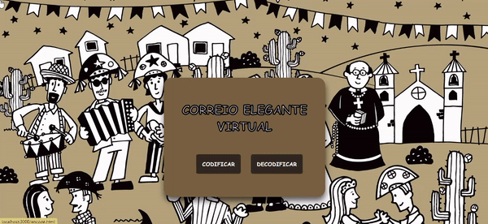

 # :love_letter: Correio Elegante Virtual

## Índice

* [1. Prefácio](#1-prefácio)
* [2. Sobre o projeto](#2-sobre-o-projeto)
* [3. Considerações gerais](#3-considerações-gerais)
* [4. Layout](#5-layout)
* [5. Tecnologias utilizadas](#5-tecnologias-utilizadas)
* [6. Implementações Futuras](#6-implementações-futuras)
* [7. Desenvolvedora](#7-desenvolvedora)

***

## 1. Prefácio

Encriptar significa ocultar o conteúdo de uma mensagem a olho nu,
para que somente as partes autorizadas possam decifrar um texto cifrado.
A [cifra de César](https://pt.wikipedia.org/wiki/Cifra_de_C%C3%A9sar)
é um dos primeiros tipos de criptografias conhecidas na história.
O imperador romano Júlio César utilizava essa cifra para enviar
ordens secretas aos seus generais no campo de batalha.

A cifra de César é uma das técnicas mais simples de cifrar uma mensagem. É um
tipo de cifra por substituição, em que cada letra do texto original é
substituida por outra que se encontra há um número fixo de posições
(deslocamento) mais a frente do mesmo alfabeto.

Por exemplo se usarmos o deslocamento (_offset_) de 3 posições:

* Alfabeto sem cifrar: A B C D E F G H I J K L M N O P Q R S T U V W X Y Z
* Alfabeto com cifra:  D E F G H I J K L M N O P Q R S T U V W X Y Z A B C
* A letra A será D
* A palavra CASA será FDVD

Atualmente todas as cifras de substituição alfabética simples, são decifradas
com facilidade e não oferecem muita segurança na comunicação por si mesma,
mas a cifra de César muitas vezes pode fazer parte de um sistema
mais complexo de criptografia, como
a cifra de Vigenère, e tem aplicação no sistema ROT13.

## 2. Sobre o projeto

Correio Elegante Virtual foi a primeira aplicação web desenvolvida durante o bootcamp da Laboratória. 

É uma aplicação temática de festa junina, que tem como objetivo ser uma ferramenta que auxilia o remetente apaixonado na criação de mensagens anônimas e a prova de curiosos para a sua pessoa amada, e o destinatário pode, após receber a mensagem, utilizar a mesma aplicação para desvendar o seu conteúdo. 

Então pensando nisso, foi desenvolvida uma aplicação web que permite **codificar** e **decodificar** uma mensagem, e indicar logo abaixo do campo de texto um *deslocamento* para realizar completamente a função escolhida.

**Em exemplo prático:**

* Para aqueles que estão apaixonados, durante a época de festa junina, pode acessar a aplicação para criar uma mensagem segura e anônima para enviar a outra pessoa.
* O destinatário também pode utilizar a aplicação para descobrir o teor da mensagem que recebeu do seu remetente.

### Para acessar o projeto clique aqui

## 3. Considerações gerais

* Este projeto foi desenvolvido individualmente durante o bootcamp da Laboratória;
* Foi trabalhado com base em boilerplate, estrutura básica de um projeto em diferentes pastas (através de módulos em JS);
* Para diminuição de problemas futuros, o projeto passou por testes unitários. 

## 4. Layout

Na página inicial haverá um menu, no qual é possível escolher entre as opções de codificar e decodificar uma mensagem. Feita a seleção, aparece uma interface que permite ao usuário:

* Codificar uma mensagem

  - No campo mensagem, insira o conteúdo que deseja codificar;

  - Logo abaixo terá um campo para escolher o número de deslocamento desejado. O número será inteiro e positivo; 

  - Clique no botão enviar;

  - Veja o resultado da sua mensagem codificada no campo *'mensagem codificada'*;

  - Caso queira limpar os campos escolhidos, aperte o botão limpar e, se deseja retornar ao menu clique no botão *'voltar ao menu'*.

* Decodificar uma mensagem

   - No campo mensagem insira o texto (conteúdo) que deseja decodificar/decifrar;

   - Logo abaixo terá um campo para escolher o número de deslocamento desejado. O número será inteiro e positivo;

   - Clique no botão enviar;

   - Veja o resultado da sua mensagem decodificada no campo *'mensagem decodificada'*;

   - Caso queira limpar os campos escolhidos, aperte o botão limpar e, se deseja retornar ao menu clique no botão *'voltar ao menu'*.

## 5. Tecnologias utilizadas

* HTML
* CSS
* Node.js
* JavaScript
* Git
* GitHub

## 6. Implementações futuras

* Responsividade da página;
* Permitir envios de mensagens entre rementente e destinatário (atualmente só é possível a criação da mensagem); 
* Permitir o uso de letras minúsculas e outros caracteres.

## 7. Desenvolvedora

 
[Isabela Tenório](https://github.com/belatenorio)

